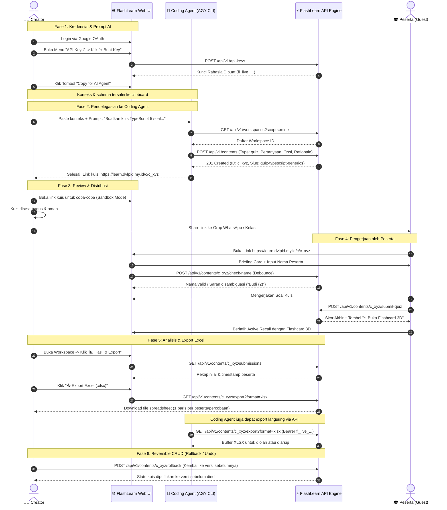

# 🤖 Use Case: AI Coding Agent Collaboration & Reversible CRUD Lifecycle

Dokumentasi ini merinci alur kerja utama (*End-to-End Core Lifecycle*) kolaborasi antara **Creator Manusia**, **AI Coding Agent (AGY CLI / Antigravity)**, dan **Peserta Belajar (Guest)** pada platform **FlashLearn**.

---

## 🗺️ Diagram Alur Usecase Lengkap



---

## 1. Fase 1: Pembuatan API Key & Fitur "Copy for AI"

1. **Akses Dashboard:** Creator masuk ke FlashLearn (`https://learn.dvlpid.my.id`).
2. **Buka Modal API Key:** Klik tombol **"🔑 API Key"** pada navigasi atas atau menu Creator.
3. **Generate Kunci Baru:** Berikan label (misal: `AGY Assistant 2026`) lalu klik **"+ Buat Key"**.
4. **Tombol "Copy for AI Agent":**
   - Di modal pembuatan API key, terdapat tombol cerdas **"🤖 Copy for AI Agent"**.
   - Ketika ditekan, sistem otomatis menyusun prompt terstruktur ke clipboard berisi:
     - **Base URL:** `https://learn.dvlpid.my.id/api/v1`
     - **Secret API Key:** `fl_live_...`
     - **OpenAPI Scalar Documentation Link:** `https://learn.dvlpid.my.id/docs`
     - **Schema Pembuatan Konten:** JSON contoh lengkap untuk tipe `materi`, `quiz`, dan `combined`.
     - **Endpoint Reversible CRUD & Export:** Panduan rollback dan download Excel.

---

## 2. Fase 2: Eksekusi oleh AI Coding Agent (AGY CLI)

Creator cukup menempelkan teks clipboard tersebut ke terminal AGY CLI atau Antigravity Agent:

### Contoh Prompt Creator:
> *"Tolong buatkan 1 modul kuis interaktif berisi 5 soal tentang Async Programming & Promises di TypeScript pada workspace saya. Jika sudah selesai, berikan saya link publiknya."*

### Langkah Otomatis yang Dilakukan Coding Agent:
1. **Mengecek Workspace yang Ada:**
   ```bash
   curl -s -H "Authorization: Bearer fl_live_..." \
     "https://learn.dvlpid.my.id/api/v1/workspaces?scope=mine"
   ```
2. **Membuat Konten Kuis Baru via API:**
   ```bash
   curl -s -X POST "https://learn.dvlpid.my.id/api/v1/contents" \
     -H "Authorization: Bearer fl_live_..." \
     -H "Content-Type: application/json" \
     -d '{
       "workspaceId": "f42e315b-3f1e-44de-9869-1cd1033ed061",
       "type": "quiz",
       "title": "TypeScript Async & Promise Mastery",
       "summary": "Kuis evaluasi kemampuan asynchronous TypeScript dan error handling.",
       "questions": [
         {
           "id": "q1",
           "question": "Apa output dari Promise.resolve(1).then(x => x + 1)?",
           "options": [
             { "id": "o1", "text": "Promise berisi angka 2", "isCorrect": true },
             { "id": "o2", "text": "Nilai 2 secara sinkron" },
             { "id": "o3", "text": "undefined" }
           ],
           "explanation": ".then mengembalikan Promise baru yang membungkus nilai balikan callback.",
           "difficulty": "medium"
         }
       ],
       "isPublished": true
     }'
   ```
3. **Mengembalikan Link ke Creator:**
   Agent membalas dengan link publik: `https://learn.dvlpid.my.id/c/<content-id>`.

---

## 3. Fase 3 & 4: Distribusi & Pengalaman Peserta (Guest)

1. **Uji Coba oleh Creator:** Creator membuka link kuis untuk mencoba sendiri kelayakan pertanyaan, bobot materi, dan tampilan.
2. **Pembagian Link:** Creator membagikan tautan ke grup WhatsApp peserta/kelas.
3. **Onboarding Peserta Ramah UX:**
   - Peserta membuka link melalui peramban HP atau laptop tanpa perlu mendaftar akun.
   - Layar menampilkan **Briefing Card** (Topik kuis, jumlah soal, dan perkiraan waktu).
   - Peserta diminta menginput **Nama Peserta**.
   - Sistem melakukan pengecekan seketika (*realtime check*). Jika nama sudah pernah dipakai di kuis tersebut, sistem menampilkan saran 1-klik ramah (*"Budi (2)"*) tanpa memblokir peserta.
4. **Pengerjaan & Evaluasi:**
   - Peserta menjawab setiap soal dengan tampilan fokus bebas distraksi.
   - Di akhir pengerjaan, skor langsung dihitung dan tersimpan ke database.
5. **Post-Quiz Active Recall Flashcard:**
   - Peserta dapat langsung menekan tombol **"⚡ Buka Soal dalam Bentuk Flashcard"** untuk membalik kartu 3D dan mengingat kembali materi soal yang keliru.

---

## 4. Fase 5: Analisis Hasil & Export Excel (.xlsx / .csv)

### Di Web Dashboard Creator:
- Creator membuka halaman Workspace di FlashLearn.
- Pada kartu kuis bersangkutan, klik tombol **"📊 Hasil & Export Excel"**.
- Modal interaktif akan menampilkan tabel rekapitulasi:
  - **No**
  - **Nama Peserta**
  - **Nilai Akhir (%)**
  - **Skor Benar / Total Soal**
  - **Status Kelulusan** (Lulus / Belum Lulus)
  - **Waktu Pengerjaan Lengkap (WIB)**
- Klik tombol hijau **"📥 Export Excel (.xlsx)"** untuk mengunduh spreadsheet yang rapi dan siap olah.

### Di Jalur AI Coding Agent (Programmatic Export):
Coding agent dapat mengunduh atau membaca data submission langsung via REST API:
```bash
# Download file Excel biner langsung:
curl -s -H "Authorization: Bearer fl_live_..." \
  "https://learn.dvlpid.my.id/api/v1/contents/<content-id>/export?format=xlsx" \
  -o "hasil_kuis.xlsx"

# Atau minta format CSV dengan UTF-8 BOM:
curl -s -H "Authorization: Bearer fl_live_..." \
  "https://learn.dvlpid.my.id/api/v1/contents/<content-id>/export?format=csv" \
  -o "hasil_kuis.csv"

# Atau ambil format JSON untuk analisis otomatis oleh coding agent:
curl -s -H "Authorization: Bearer fl_live_..." \
  "https://learn.dvlpid.my.id/api/v1/contents/<content-id>/submissions"
```

---

## 5. Fase 6: Reversible CRUD (Undo, Soft-Delete & Snapshot Rollback)

Untuk menjamin keandalan saat dimanipulasi oleh coding agent atau creator, seluruh operasi mutasi data di FlashLearn bersifat **dapat dikembalikan ke keadaan semula (*reversible*)**:

### 1. Snapshot Versioning & Rollback Konten (`POST /rollback`)
- Setiap kali konten dibuat (`create`) atau diperbarui (`update`), FlashLearn secara otomatis merekam snapshot keadaan data ke tabel `content_versions` dengan nomor versi yang berurutan.
- Jika coding agent atau creator salah mengedit konten, mereka dapat memanggil endpoint rollback:
  ```bash
  # Rollback ke versi sebelumnya (N-1):
  curl -X POST "https://learn.dvlpid.my.id/api/v1/contents/<content-id>/rollback" \
    -H "Authorization: Bearer fl_live_..." \
    -H "Content-Type: application/json" \
    -d '{}'

  # Atau rollback ke versi spesifik (misal versi 1):
  curl -X POST "https://learn.dvlpid.my.id/api/v1/contents/<content-id>/rollback" \
    -H "Authorization: Bearer fl_live_..." \
    -H "Content-Type: application/json" \
    -d '{"versionNumber": 1}'
  ```
- **Auditable Rollback:** Tindakan rollback itu sendiri disimpan sebagai versi baru bertanda `rollback:vX`, sehingga riwayat perbaikan tetap tercatat rapi tanpa menghapus jejak masa lalu.

### 2. Soft-Delete & Restore Konten (`DELETE` & `POST /restore`)
- Menghapus konten tidak langsung memusnahkannya secara fisik dari database. Sistem menandai kolom `deleted_at = NOW()`.
- Untuk membatalkan penghapusan (*restore/undelete*):
  ```bash
  curl -X POST "https://learn.dvlpid.my.id/api/v1/contents/<content-id>/restore" \
    -H "Authorization: Bearer fl_live_..."
  ```

### 3. Reversible Workspace Management
- Mekanisme yang sama diterapkan pada entitas `workspaces`:
  - `POST /api/v1/workspaces/<workspace-id>/rollback`
  - `POST /api/v1/workspaces/<workspace-id>/restore`

---

## 6. Ringkasan Endpoint API Lengkap untuk Coding Agent

| Endpoint | Method | Fungsi | Akses |
| :--- | :--- | :--- | :--- |
| `/api/v1/workspaces?scope=mine` | `GET` | List ruang kerja milik creator | Creator / Agent |
| `/api/v1/contents` | `POST` | Buat materi, kuis, atau gabungan baru | Creator / Agent |
| `/api/v1/contents/:id` | `PUT` | Perbarui isi konten (Auto-snapshot) | Creator / Agent |
| `/api/v1/contents/:id` | `DELETE` | Hapus konten secara aman (Soft delete) | Creator / Agent |
| `/api/v1/contents/:id/rollback` | `POST` | Kembalikan konten ke versi sebelumnya | Creator / Agent |
| `/api/v1/contents/:id/restore` | `POST` | Pulihkan konten yang terhapus | Creator / Agent |
| `/api/v1/contents/:id/versions` | `GET` | Lihat riwayat versi & snapshot | Creator / Agent |
| `/api/v1/contents/:id/submissions`| `GET` | Ambil data rekapan peserta (JSON) | Creator / Agent |
| `/api/v1/contents/:id/export` | `GET` | Unduh rekapan Excel (.xlsx) atau CSV | Creator / Agent |
