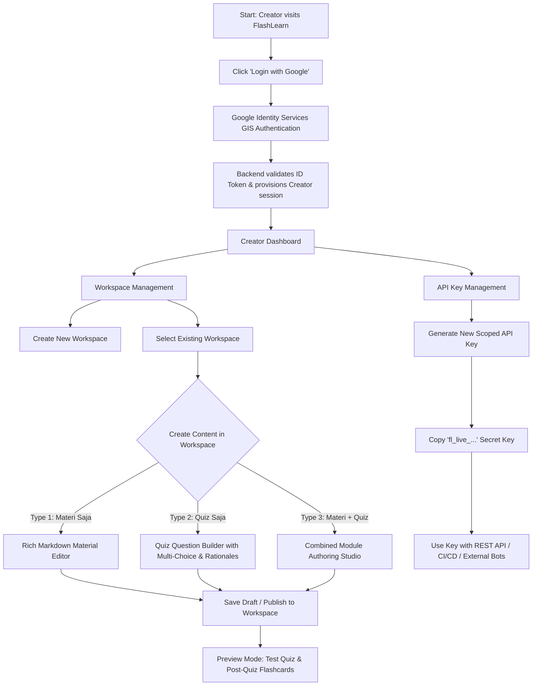

# User Flow: Creator (Content Author & Educator)

## Overview
Creator users are verified educators, instructors, or content authors. They log in via Google OAuth, create and organize Workspaces, publish different content types, review student engagement, and generate Scoped API Keys for programmatic CRUD operations.

## Step-by-Step Flow

### 1. Google OAuth Authentication
1. User clicks **"Masuk dengan Google"** in the top navigation.
2. The Google One-Tap / Sign-In popup opens using client credentials:
   - `GOOGLE_CLIENT_ID`: `your-google-client-id.apps.googleusercontent.com`
3. Upon approval, Google returns a cryptographically signed ID Token (JWT).
4. Web app dispatches `POST /api/v1/auth/google` with `{ credential }`.
5. Backend verifies token authenticity via Google Public Keys, provisions a `creator` account if new, and returns a secure JWT bearer token and user profile.

### 2. Workspace Management
- Creators organize all their work within Workspaces.
- **Rules & Scoping**:
  - A creator can only view, edit, or delete workspaces created by their account.
  - A creator cannot view or alter other creators' private workspaces.
- Actions:
  - **Create Workspace**: Name, description, slug, icon/cover, and visibility status (`public` or `private`).
  - **Edit Workspace**: Update metadata and privacy settings.
  - **Delete Workspace**: Safely cascade deletes workspace contents after confirmation.

### 3. Content Authoring (Three Types)
Inside a selected workspace, creators can create three distinct types of learning objects:

#### Type A: Materi Saja
- Title, summary, reading time estimate, markdown body with code highlighting, image attachments, and key concept tags.

#### Type B: Quiz Saja
- Title, passing score, question list.
- For each question:
  - Question prompt (markdown/math supported).
  - Multiple choices (options A, B, C, D...) with a single or multiple correct flags.
  - Explanation / rationale shown after answering.
  - Hint text (optional).
  - Difficulty level (*Easy*, *Medium*, *Hard*).

#### Type C: Materi & Quiz Digabung
- Module structure containing:
  - Theory reading section (Materi).
  - Attached checkpoint quiz (Quiz) assessing the immediate material.
  - Settings: Require passing quiz before module completion.

### 4. Flashcard Preview & Verification
- Creators can preview their quiz in "Flashcard Mode" at any time.
- Verifies that quiz questions translate well into flashcards (concise prompts, definitive answers, crisp explanations).

### 5. API Key Management
- Creators can navigate to **Settings ➔ API Keys**:
  - Click **"Generate New Key"**.
  - Set a descriptive label (e.g., `Obsidian Sync`, `LMS Exporter`, `Discord Bot`).
  - Set expiry duration (30 days, 90 days, 1 year, or Never).
  - Set permission scopes (e.g., `workspace:read`, `content:write`).
- The system generates a cryptographic secret key prefixed with `fl_live_...` (shown once).
- Creator can revoke keys at any time.
- When used in HTTP requests (`Authorization: Bearer fl_live_...`), the API allows CRUD operations strictly constrained to the creator's own workspaces and contents.
