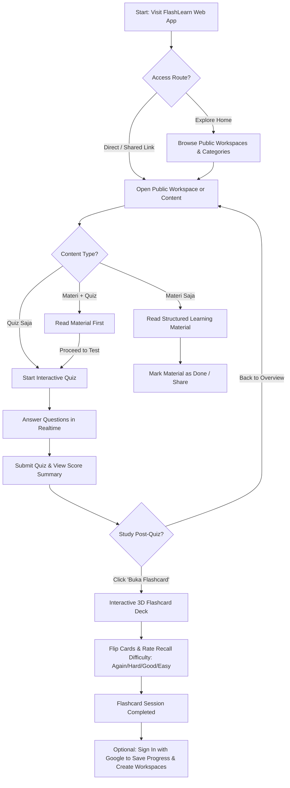

# User Flow: Guest (Public Learner)

## Overview
Guest users can access and interact with public educational resources without authentication. FlashLearn emphasizes zero-friction learning, allowing guests to read materials, take quizzes, and immediately study with tactile 3D flashcards.

## Step-by-Step Flow

### 1. Landing & Discovery
- Guest lands on the application homepage (`/`) or directly via a shared link (`/workspace/:id` or `/content/:id`).
- No login wall or modal blockage. The user can immediately view public workspaces, search topics, or filter by content type (`Materi`, `Quiz`, `Materi + Quiz`).

### 2. Consuming Content Modes
- **Mode 1: Materi Saja (`/content/:id/read`)**
  - Clean, distraction-free reading typography (Plus Jakarta Sans headlines, Inter body).
  - Estimated reading time and key concepts outline.
- **Mode 2: Quiz Saja (`/content/:id/quiz`)**
  - Interactive quiz runner with smooth question transitions.
  - Option to see instant rationale or wait until full completion.
- **Mode 3: Materi & Quiz Digabung (`/content/:id/module`)**
  - Section 1 displays the educational theory and reading module.
  - Section 2 unlocks the integrated checkpoint quiz to test the user right after reading.

### 3. Post-Quiz Flashcard Engine
- Upon submitting any quiz, the results screen displays:
  - Total score, correct vs incorrect breakdown.
  - A prominent action button: **⚡ Buka Soal dalam Bentuk Flashcard**.
- Tapping the button launches an interactive 3D Flashcard study deck:
  - **Front of Card**: The quiz question prompt and related concept tag.
  - **Tap / Space to Flip**: Card flips 180° with physical perspective and shadow depth.
  - **Back of Card**: The correct answer, comprehensive explanation, and spaced-repetition feedback buttons (*Again, Hard, Good, Easy*).
  - The deck auto-recycles questions marked *Again* or *Hard* until full mastery is achieved.

### 4. Progression & Conversion
- At the end of the session, guests receive a friendly prompt:
  - *"Ingin membuat kuis & materi sendiri, atau menyimpan riwayat belajarmu? Masuk dengan Google sekarang."*
  - Single-click Google Sign-In is always available in the top navbar.
