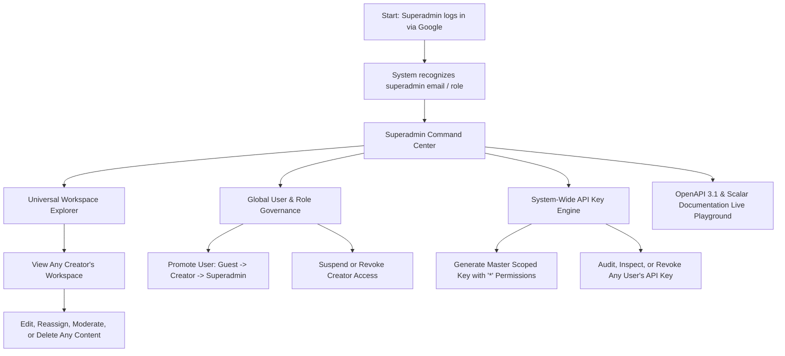

# User Flow: Superadmin (Platform Governance)

## Overview
Superadmin users hold full governance over the entire FlashLearn instance. They have universal read/write access across all workspaces, user accounts, content entities, and API keys.

## Step-by-Step Flow

### 1. Superadmin Authentication & Elevating
- Superadmin signs in using Google OAuth with authorized admin emails (configured via environment variable `SUPERADMIN_EMAILS` or flagged in database).
- Session gains the `superadmin` role token claims.

### 2. Universal Workspace Governance
- While normal Creators can only see their own workspaces, Superadmins have a **Universal Filter**:
  - View all workspaces across all creators in the system.
  - Search by creator name, title, or status.
  - Directly open, edit, update visibility, or delete any workspace.
  - Moderate flagged content (quizzes with errors, offensive material).

### 3. User & Role Management
- Table of all registered users with their Google email, name, avatar, role, and registration date.
- Actions:
  - Change user role: `creator` ⇄ `superadmin`.
  - Disable or ban malicious accounts.

### 4. System-Wide API Keys & Master Integrations
- Superadmin can view all active API keys issued across the platform.
- Ability to generate a **Master API Key**:
  - Full wild-card access (`*`) to all REST endpoints.
  - Usable by DevOps pipelines, automated content seeders, backup scripts, and internal bots.
- Capability to instantly revoke compromised keys.

### 5. API Documentation & OpenAPI Playground
- Superadmins can open `/docs` or `/swagger` powered by Scalar:
  - Interactive visual testing of all endpoints.
  - Authorize with either Bearer JWT or `fl_live_...` API key.
  - Export OpenAPI 3.1 JSON / YAML schemas for external client SDK generation.
